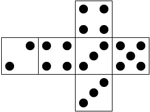

# NDice

[](https://travis-ci.org/MrTarantula/NDice)
[](https://codecov.io/gh/MrTarantula/NDice)
[](https://nuget.org/packages/NDice)
[](https://nuget.org/packages/NDice)

Dice toolkit for .Net. Construct dice with interesting behaviors.

> API is very unstable and will be for a while.

## Table of Contents

- [Installation](#installation)
- [How To Use](#how-to-use-tldr)
- [Types of Dice](#types-of-dice)
  - [Die](#die)
  - [WeightedDie](#weighteddie)
  - [GamblersDie](#gamblersdie)
  - [TappersDie](#tappersdie)
  - [Die Examples](#die-examples)
- [IRandomizable](#irandomizable)
- [Real World Examples](#real-world-examples)
- [Building Advanced Dice](#building-advanced-dice)
  - [Sides](#sides)
  - [Labels](#labels)
  - [Randomizer](#randomizer)
  - [Weights](#weights)
  - [Tapped/Untapped](#tapped/untapped)
  - [Advanced Die Examples](#advanced-die-examples)
- [Contributing](#contributing)
- [Future Work](#future-work)
- [Acknowledgements](#Acknowledgements)

## Installation

```C#
dotnet add package NDice
// OR
Install-Package NDice
```

## How To Use (tl;dr)

```C#
var die = new Die(); // Creates a new six-sided die

int result = die.Roll();
```

## Types of Dice

### [`Die`](NDice/Die.cs)

A fair die. It is not weighted, and as random as its randomizer can be.

### [`WeightedDie`](NDice/WeightedDie.cs)

Die with one or more sides weighted to have a higher probablility of occurrence.

### [`GamblersDie`](NDice/GamblersDie.cs)

Weighted die that obeys the [Gambler's Fallacy](https://github.com/xori/gamblers-dice). The weight shifts after each roll, so that the longer a side has not been rolled, the higher its probability of occurrence for the next roll.

### [`TappersDie`](NDice/TappersDie.cs)

A [tapper's die](http://www.dice-play.com/DiceCrooked.htm) behaves like a fair die, until it is tapped. Then it behaves like a weighted die until it is tapped again.

### Die Examples

Dice can be constructed with a default of six sides, or any number of sides:

```C#
var fairDie = new Die();

var weightedDie = new WeightedDie();

var bigFairDie = new Die(225);
```

> NOTE: Most types of weighted dice constructed with no weights will behave like a fair die

`WeightedDie` and dice derived from it (e.g. `GamblersDie`) can be constructed with weights for each side, using a series of numbers or an array.

> Percentages can be used, but the total weight must equal 1. Try to use nicely dividable percentages, otherwise some precision may be lost.

```C#
// Six-sided die with side 4 heavily weighted
var luckyFour = new WeightedDie(1, 1, 1, 5, 1, 1);

int probablyFour = luckyFour.Roll();
int alsoProbablyFour = luckyFour.Roll();

// Ten-sided gambler's die, with side 2 heavily weighted
int[] weights = new int[] { 1, 5, 1, 1, 1, 1, 1, 1, 1, 1 };
var firstRollLikelyTwo = new GamblersDie(weights);

int likelyTwo = firstRollLikelyTwo.Roll();
int likelyAnythingButTwo = firstRollLikelyTwo.Roll();

double[] percentWeights = new double(0.125, 0.125, 0.5, 0.125, 0.125);
var percentWeightedDie = new WeightedDie(percentWeights);
```

## [`IRandomizable`](NDice/IRandomizable.cs)

By default `System.Random` is used to roll the die ([`SystemRandomizer`](NDice/SystemRandomizer.cs)), but a generic interface `IRandomizable` can be implemented and used with any die. Below is a terrible randomizer that uses the current time to generate a "random" number.

```C#
public class SecondsRandomizer : IRandomizable
{
   public int Get(int maxValue)
   {
       int.TryParse(DateTime.Now.ToString("ss"), out int seconds);  
       return seconds % maxValue;
   }
}
```

And it can be used as the first parameter when constructing a die:

```C#
var rnd = new SecondsRandomizer();

var die0 = new Die(rnd, 8);

var die1 = new WeightedDie(rnd, 1, 1, 1, 7, 1, 1, 1);

var die2 = new GamblersDie(rnd, 20);
```

## Real World Examples

Die | Code
:-: | -
D20<br> | <pre>var d20 = new Die(20);</pre>
[Average Die<br>](https://em4miniatures.com/index.php/catalogsearch/result/?q=+average+dice) | <pre>var avgDie = new WeightedDie(1, 2, 2, 1);<br>int[] sides = new int[] { 2, 3, 4, 5 };<br><br>// Roll the die, then get the value<br>avgDie.Roll();<br>int rolledSide = sides[avgDie.Current];
Double Deuce<br> | <pre>var d2Die = new WeightedDie(1, 2, 1, 1, 1);<br>int[] sides = new int[] { 1, 2, 3, 4, 6 };<br><br>// Roll the die, then get the value<br>d2Die.Roll();<br>int rolledSide = sides[d2Die.Current];

## Building Advanced Dice

Each die can be built with a builder. Using a builder allows for more customization, such as adding string labels for each side and using a custom randomizer.

### Sides

The number of sides can be specified with `.WithSides(int)`. This can be omitted on dice that are built with weights or labels. If omitted and no weights or labels are defined the default number of sides (6) is used.

### Labels

String labels can be added to any die using `.WithLabels(params string[])`. The builder will set the number of sides to the count of the labels, so `.WithSides()` is unnecessary.

### Randomizer

Randomizers can be added one of two ways: an instance of `IRandomizable`, or a lambda that is equivalent to `IRandomizable.Get()`. If omitted the default [`SystemRandomizer`](NDice/SystemRandomizer.cs) is used.

As an example, here is a `Die` built with the [`SecondsRandomizer`](#irandomizable) mentioned above:

```C#
Die die = new DieBuilder()
   .WithSides(10)
   .WithRandomizer(maxValue =>
   {
      int.TryParse(DateTime.Now.ToString("ss"), out int seconds);
      return seconds % maxValue;
   });
```

### Weights

Weights can be added to `WeightedDie` and its derivatives using `.WithWeights(params int[])` or `.WithWeights(params double[])`, the same as the normal constructor. The builder will set the number of sides to the count of the weights, so `.WithSides()` is unnecessary.

### Tapped/UnTapped

These set the `TappersDie.Tapped` property to true or false.

### Advanced Die Examples

```C#
var die = new DieBuilder().WithSides(4).WithLabels("Blue", "Purple", "Orange", "Red").Build();

// Use explicit type instead of var to avoid calling .Build()
GamblersDie gdie = new GamblersDieBuilder()
   .WithWeights(1, 6, 4, 4, 2, 4)
   .WithRandomizer(new SystemCryptoRandomizer());

// Long chain
var tdie = new TappersDieBuilder()
   .WithSides(5)
   .WithWeights(1, 4, 1, 1, 1)
   .WithLabels("One", "Two", "Three", "Four", "Five")
   .Tapped()
   .WithRandomizer(maxValue => new System.Random().Next(maxValue))
   .Build();
```

## Contributing

See [CONTRIBUTING.md](CONTRIBUTING.md).

## Future Work

- [ ] More real world examples
- [ ] Include common dice like the examples (another package)
- [ ] More dice algorithms! (statisticians/dice enthusiasts needed. PRs welcome)
- [x] Percentages/ratios for weight
- [x] Built-in labels
- [x] Fluent die builder
- [x] Abstraction for randomizer, so other libs/algorithms may be used
- [x] Extension package for other implementations of `IRandomizable`
- [x] More tests!
- [x] Exceptions!

## Acknowledgements

This wouldn't have been made if not for stumbling upon [xori/gamblers-dice](https://github.com/xori/gamblers-dice).